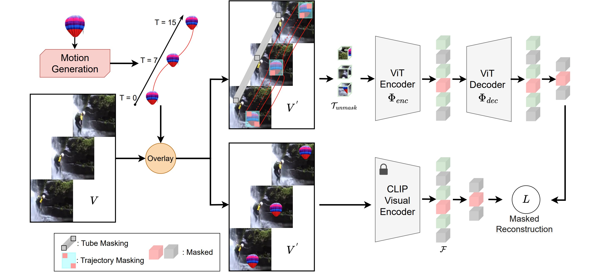

# Official PyTorch Implementation of SMILE (CVPR 2025).



[](https://opensource.org/licenses/MIT)<br>
[](https://huggingface.co/fmthoker/SMILE/tree/main/SMILE_MODELS)


> [**SMILE: Infusing Spatial and Motion Semantics in Masked Video Learning**](https://arxiv.org/abs/2504.00527)<br>
> [Fida Mohammad Thoker](https://fmthoker.github.io/), [Letian Jiang](https://tonnew5418.github.io/), [Chen Zhao](https://zhao-chen.com/), [Bernard Ghanem](https://cemse.kaust.edu.sa/profiles/bernard-ghanem)<br>King Abdullah University of Science and Technology (KAUST)

## 📰 News
<!-- **[2022.4.24]**  Code and pre-trained models are available now! <br> -->
**[2025.5.28]** Code and pre-trained models will be released here. Welcome to **watch** this repository for the latest updates.

## ✨ Highlights

### 🔥 State-of-the-art on SSv2 and K400

Our method achieves state-of-the-art performance on **SSv2** and **K400** benchmarks with a ViT-B backbone, surpassing prior self-supervised video models by up to **2.5%**, thanks to efficient *CLIP-based semantic supervision*.

### ⚡️ Leading Results Across Generalization Challenges

We evaluate our method on the [**SEVERE benchmark**](https://bpiyush.github.io/SEVERE-website/), covering domain shift, low-shot learning, fine-grained actions, and task adaptability. Our model consistently outperforms prior methods and achieves a **3.0% average gain** over strong baselines, demonstrating superior generalization in diverse video understanding tasks.

### 😮 Superior Motion Representation Without Video-Text Alignment

Compared to CLIP-based methods such as [**ViCLIP**](https://github.com/OpenGVLab/InternVideo/tree/main/Data/InternVid) and [**UMT**](https://github.com/OpenGVLab/unmasked_teacher), our model achieves higher accuracy on motion-sensitive datasets, particularly under *linear probing*. This indicates stronger video representations learned with less data and without relying on video-text alignment.

## 🚀 Main Results and Models

### ✨ Something-Something V2

|  Method  | Pretrain Dataset | Pretrain Epochs | Backbone | Top-1 | Finetune |
| :------: | :--------------: | :-------------: | :------: | :---: | :------: |
|   SMILE  |       K400       |       800       |   ViT-S  |  69.1 |   TODO   |
|   SMILE  |       K400       |       600       |   ViT-B  |  72.1 | [log](https://huggingface.co/fmthoker/SMILE/resolve/main/SMILE_MODELS/finetune/ssv2/VIT_B_600_EPOCHS/log.txt) / [checkpoint](https://huggingface.co/fmthoker/SMILE/resolve/main/SMILE_MODELS/finetune/ssv2/VIT_B_600_EPOCHS/ssv2_finetuned_after_k400_pretraining_first_stage_300_epochs_2nd_stage_300_epochs.pth) |
|   SMILE  |       K400       |       1200      |   ViT-B  |  72.4 | [log](https://huggingface.co/fmthoker/SMILE/resolve/main/SMILE_MODELS/finetune/ssv2/VIT_B_1200_EPOCHS/log.txt) / [checkpoint](https://huggingface.co/fmthoker/SMILE/resolve/main/SMILE_MODELS/finetune/ssv2/VIT_B_1200_EPOCHS/ssv2_finetuned_after_k400_pretraining_first_stage_800_epochs_2nd_stage_400_epochs.pth)
|   SMILE  |       SSv2       |       800       |   ViT-B  |  72.5 |   TODO   |

### ✨ Kinetics-400

|  Method  | Pretrain Dataset | Pretrain Epochs | Backbone | Top-1 | Pretrain | Finetune |
| :------: | :--------------: | :-------------: | :------: | :---: | :------: | :------: |
|   SMILE  |       K400       |       800       |   ViT-S  |  79.5 |   TODO   |   TODO   |
|   SMILE  |       K400       |       600       |   ViT-B  |  83.1 | [checkpoint](https://huggingface.co/fmthoker/SMILE/resolve/main/SMILE_MODELS/pretrain/k400_pretraining_first_stage_300_epochs_2nd_stage_300_epochs.pth) | [log](https://huggingface.co/fmthoker/SMILE/resolve/main/SMILE_MODELS/finetune/k400/VIT_B_600_EPOCHS/log.txt) / [checkpoint](https://huggingface.co/fmthoker/SMILE/resolve/main/SMILE_MODELS/finetune/k400/VIT_B_600_EPOCHS/k400_finetuned_after_k400_pretraining_first_stage_300_epochs_2nd_stage_300_epochs.pth) |
|   SMILE  |       K400       |       1200      |   ViT-B  |  83.4 | [checkpoint](https://huggingface.co/fmthoker/SMILE/resolve/main/SMILE_MODELS/pretrain/k400_pretraining_first_stage_800_epochs_2nd_stage_400_epochs.pth) | [log](https://huggingface.co/fmthoker/SMILE/resolve/main/SMILE_MODELS/finetune/k400/VIT_B_1200_EPOCHS/log.txt) / [checkpoint](https://huggingface.co/fmthoker/SMILE/resolve/main/SMILE_MODELS/finetune/k400/VIT_B_1200_EPOCHS/k400_finetuned_after_k400_pretraining_first_stage_800_epochs_2nd_stage_400_epochs.pth) |

## 🔨 Installation

Please follow the instructions in [INSTALL.md](INSTALL.md).

## ➡️ Data Preparation

Please follow the instructions in [DATASET.md](DATASET.md) for data preparation.

## 🔄 Pre-training

The pre-training instruction is in [PRETRAIN.md](PRETRAIN.md).

## ⤴️ Fine-tuning with pre-trained models

The fine-tuning instruction is in [FINETUNE.md](FINETUNE.md).

## ☎️ Contact 

Fida Mohammad Thoker: fida.thoker@kaust.edu.sa

## 👍 Acknowledgements

We sincerely thank [Michael Dorkenwald](https://mdorkenwald.com/) for providing the object image dataset that supports this work.<br>
This project is built upon [VideoMAE](https://github.com/MCG-NJU/VideoMAE) and [tubelet-contrast](https://github.com/fmthoker/tubelet-contrast). Thanks to the contributors of these great codebases.

## 🔒 License

This project is released under the MIT license. For more details, please refer to the [LICENSE](https://github.com/fmthoker/SMILE/blob/main/LICENSE) file.

## ✏️ Citation

If you think this project is helpful, please feel free to leave a star⭐️ and cite our paper:

```
@inproceedings{thoker2025smile,
  author    = {Thoker, Fida Mohammad and Jiang, Letian and Zhao, Chen and Ghanem, Bernard},
  title     = {SMILE: Infusing Spatial and Motion Semantics in Masked Video Learning},
  journal   = {CVPR},
  year      = {2025},
}
```
